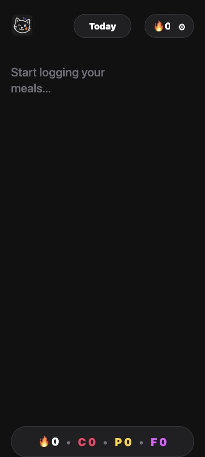
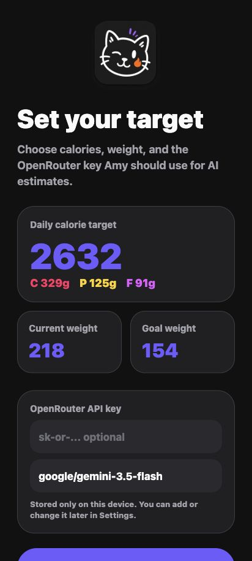
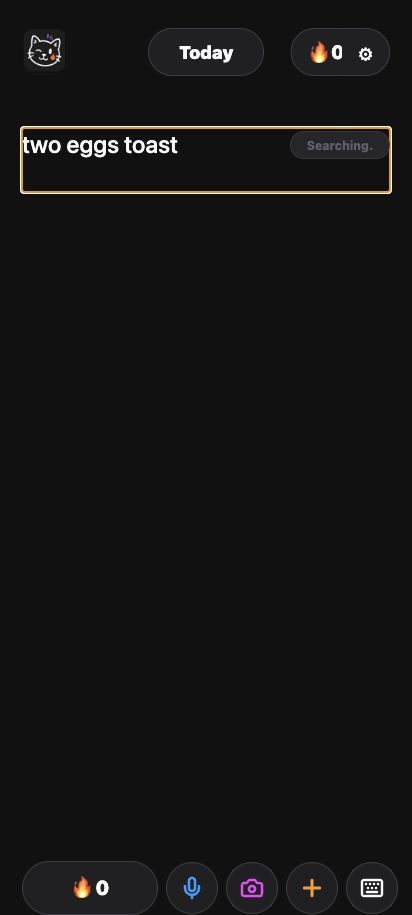
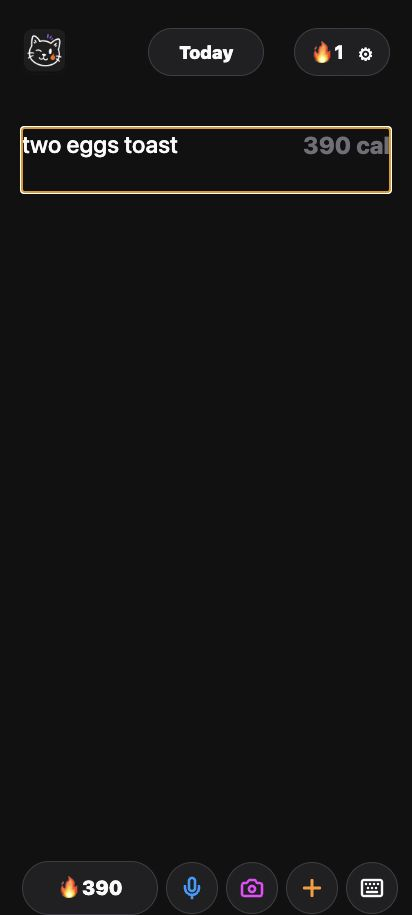
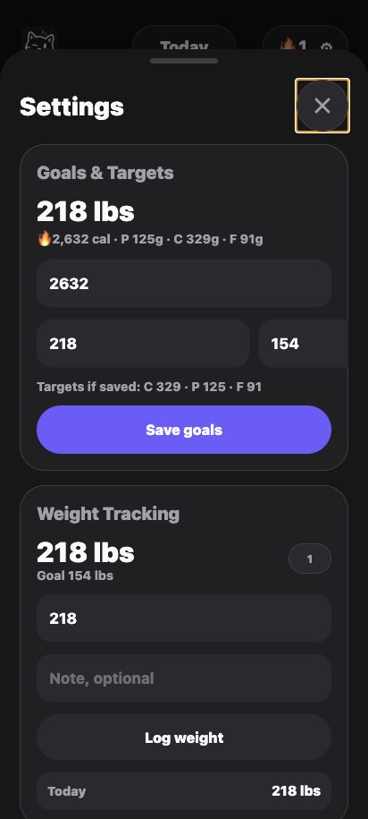

# Amy

Amy is an Android calorie tracker where logging feels like writing a note.

Type one food per line, press Enter, and Amy turns the line into editable calories and macros. Scan packaged foods with Open Food Facts, estimate meals or labels with your own OpenRouter key, and keep your diary data on your device.

<p align="center">
  <a href="https://github.com/kausthubh-coder/amy/releases/latest">
    
  </a>
  <a href="https://github.com/kausthubh-coder/amy/issues/new/choose">
    
  </a>
  <a href="LICENSE">
    
  </a>
</p>



## What Amy Does

Most calorie apps make you search first and think later. Amy starts from the fastest habit: write down what you ate.

| Fast logging | Food capture | Local control |
| --- | --- | --- |
| One line equals one food or meal | Barcode lookup through Open Food Facts | On-device diary storage |
| Enter-to-estimate workflow | Food photo estimates with OpenRouter | JSON export and import |
| Editable calories and macros | Nutrition label photo estimates | OpenRouter key stored locally |
| Saved meals for repeat foods | Dictation entry when available | No ads or tracking SDKs |
| Swipe between days | Optional rough restaurant context | No account required |

Manual logging works without an account, subscription, or API key. External services are only used when you choose a feature that needs one.

## Install

The official APK is published through GitHub Releases:

[Download the latest Amy APK](https://github.com/kausthubh-coder/amy/releases/latest)

Current app metadata:

| Field | Value |
| --- | --- |
| Android package | `com.kaust.amy` |
| Current source version | `1.0.8` |
| Current Android `versionCode` | `10` |
| Minimum Android version | Android 7.0 / API 24 through Expo React Native defaults |
| Latest release tag | `v1.0.8` |

Install notes:

- Android may ask you to allow APK installs from your browser or file manager.
- Export your data from Settings before switching between unofficial builds.
- GitHub Release notes should include the APK filename, version, `versionCode`, and SHA-256 checksum.
- See [docs/RELEASE_PROCESS.md](docs/RELEASE_PROCESS.md) for the build and release checklist.

## Screenshots

| Onboarding | Today | Searching | Logged line | Settings |
| --- | --- | --- | --- | --- |
|  |  |  |  |  |

## Distribution Status

Amy is public source and source-available today. It is not currently eligible for the official F-Droid main repository because Amy uses the PolyForm Noncommercial License 1.0.0, which is not a FLOSS license.

Official F-Droid main submission would require a maintainer decision to relicense Amy under a recognized FLOSS license, then a source-built `fdroiddata` recipe. A separate non-main F-Droid repository or source-available Android catalog may be possible under current licensing, depending on that catalog's policies.

Read the current audit in [docs/FDROID_READINESS_AUDIT.md](docs/FDROID_READINESS_AUDIT.md) and the broader distribution plan in [docs/SOURCE_AVAILABLE_DISTRIBUTION_PLAN.md](docs/SOURCE_AVAILABLE_DISTRIBUTION_PLAN.md).

## Privacy

Amy is built around local-first logging:

- Diary entries, saved meals, goals, weight logs, corrections, exports, and imports live in local app storage.
- OpenRouter is optional and only used when you add your own key in Settings.
- Open Food Facts is used for packaged-food barcode lookup.
- Optional rough location context can help restaurant estimates, and can be turned off.
- JSON exports intentionally remove the saved OpenRouter key.

Read [PRIVACY.md](PRIVACY.md) for the full data, permission, and network-service disclosure.

## Run Locally

```sh
npm install
npm test
npm run dev
```

Before a release candidate, also run:

```sh
npm run audit:release
npm run prebuild:android
```

Generated `android/`, `ios/`, APK, and AAB outputs stay out of git unless a maintainer explicitly asks for them.

## Contributing

Amy welcomes focused fixes, Android testing, accessibility polish, docs improvements, and careful feature work that keeps logging fast.

Useful starting points:

- [Contributing guide](CONTRIBUTING.md)
- [Bug report](https://github.com/kausthubh-coder/amy/issues/new?template=bug_report.yml)
- [Install or compatibility report](https://github.com/kausthubh-coder/amy/issues/new?template=install_compatibility.yml)
- [Feature request](https://github.com/kausthubh-coder/amy/issues/new?template=feature_request.yml)
- [Security and privacy reports](SECURITY.md)

## License

Amy is released under the [PolyForm Noncommercial License 1.0.0](LICENSE).

You can use, copy, modify, and share the code for non-commercial purposes. Commercial use, selling the app/code, paid hosted versions, paid forks, or monetized redistribution requires written permission.

Third-party dependency, service, and asset notices live in [docs/THIRD_PARTY_NOTICES.md](docs/THIRD_PARTY_NOTICES.md).

Commercial licensing, relicensing, or distribution permission requests: [kausthubh2007@gmail.com](mailto:kausthubh2007@gmail.com)
