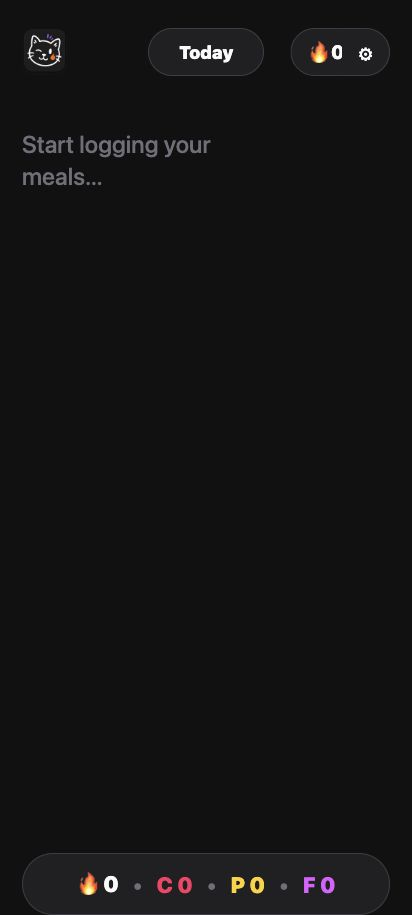
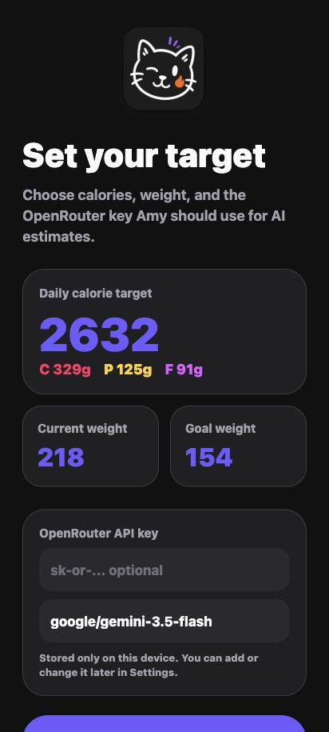
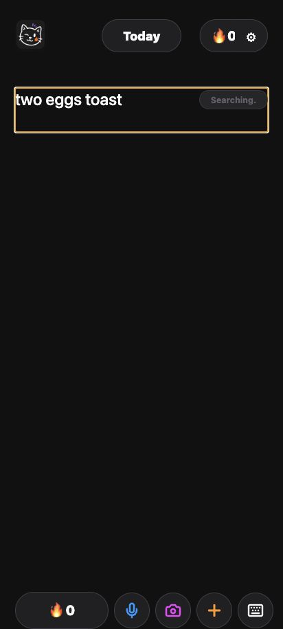
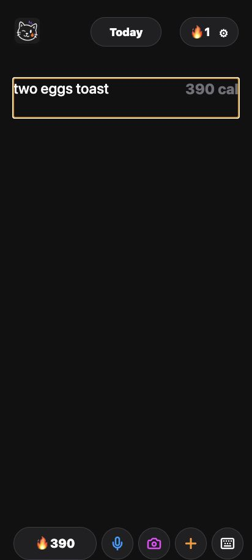
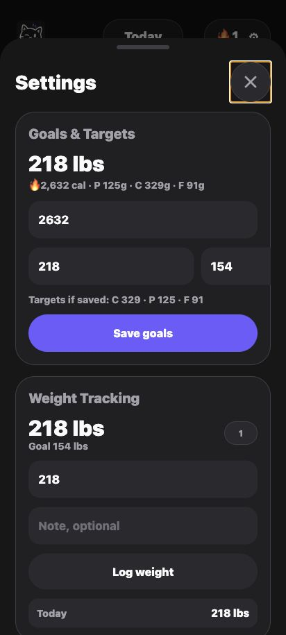

# Amy

Amy is an open-source Android calorie tracker where logging feels like writing a note.

Type one food per line, press Enter, and Amy turns the line into editable calories and macros. Use saved meals for repeat foods, scan packaged foods through Open Food Facts, and optionally estimate typed lines, food photos, or nutrition labels with your own OpenRouter key. Without a key Amy never guesses: type the calories inline (`latte 190 cal`) or tap `+ cal`, and Amy remembers the numbers for next time.

Amy is early, Android-first, and looking for testers who care about fast logging, local data, and non-annoying calorie tracking.

<p align="center">
  <a href="https://github.com/kausthubh-coder/amy/releases/latest">
    
  </a>
  <a href="https://github.com/kausthubh-coder/amy/issues/new/choose">
    
  </a>
  <a href="LICENSE">
    
  </a>
</p>



## Why Amy Exists

Most calorie apps make logging feel like database work: search, tap, confirm, edit serving, dismiss upsells, repeat. Amy starts from the habit people already understand:

```text
oatmeal with banana
turkey sandwich
protein shake
2 eggs
```

Each line becomes a meal entry. The note stays readable, and calories line up on the right so you can edit mistakes without losing the diary feel.

## Who It Is For

Amy is a good fit if you want:

- A fast Android food log that feels closer to notes than a spreadsheet.
- Local-first diary storage with JSON export/import.
- No account, ads, or tracking SDKs.
- Barcode lookup through Open Food Facts (Android camera uses Google ML Kit).
- Optional AI estimates where you bring your own OpenRouter key.
- A small app that is still actively changing based on tester feedback.

It is not a good fit yet if you need a polished commercial diet platform, verified medical nutrition advice, a giant proprietary food database, iOS support, or installation from official f-droid.org. IzzyOnDroid is the intended F-Droid-compatible catalog.

## Current Status

| Area | Status |
| --- | --- |
| Android APK | Available from GitHub Releases |
| Current version | `1.0.10` |
| Android package | `com.kaust.amy` |
| Minimum Android version | Android 7.0 / API 24 |
| Data model | Local app storage with JSON export/import |
| Product database | Open Food Facts only |
| AI estimates | Optional, user-supplied OpenRouter key |
| License | GPL-3.0-or-later |
| IzzyOnDroid | Ready to request after a signed arm64 GitHub Release APK |
| Official f-droid.org | Not the current target (keeps ML Kit barcode) |

## Install

Download the latest APK from GitHub Releases:

[Download Amy for Android](https://github.com/kausthubh-coder/amy/releases/latest)

Android may ask you to allow APK installs from your browser or file manager. Export your data from Settings before switching between unofficial builds.

1.0.10 is the first **release-signed arm64** APK. If you installed debug-signed 1.0.9, export diary JSON from Settings and uninstall before installing 1.0.10.

If install fails, please open an [install compatibility report](https://github.com/kausthubh-coder/amy/issues/new?template=install_compatibility.yml) with your device model, Android version, APK version, and what happened.

## Screenshots

| Onboarding | Today | Searching | Logged line | Settings |
| --- | --- | --- | --- | --- |
|  |  |  |  |  |

## Features

| Logging | Review | Control |
| --- | --- | --- |
| One food per line | Daily calorie total | Local diary storage |
| Enter-to-estimate workflow | Macro targets | JSON export/import |
| Saved meals | Stats and streaks | OpenRouter key stored locally |
| Food photo estimates | Weight logs | No account required |
| Nutrition label estimates | Android widgets | No ads or tracking SDKs |
| Barcode scan with Open Food Facts | Previous/next day swipe | No Firebase |

Manual logging works without an account, subscription, or API key. Network services are only used when you choose a feature that needs one.

### How estimates work

- **Your numbers first.** Foods you corrected or entered by hand, and saved meals, are matched locally (including quantities like `2 protein shakes`) with no network call.
- **One request per batch.** Pending lines are estimated together, with context the model needs: local time, region and units, optional rough location, what is already logged today, and your known foods.
- **Breakdowns stay editable.** `burger, fries and a coke` keeps three items you can adjust or remove; single foods get a servings/grams portion you can scale.
- **Honest uncertainty.** Each estimate carries the assumptions it made and a confidence level; low-confidence lines are marked with `~`. Impossible numbers (calories that cannot match the macros) are corrected before logging.
- **Review before logging.** Photo, label, and barcode results show a confirmation card first.
- **Failures are visible.** Errors show a `Retry` chip and a message, never a placeholder number.

Measure prompt or model changes with `OPENROUTER_API_KEY=... npm run eval:agent`.

## What Needs Testing

Amy needs practical Android reports more than vague praise. Useful feedback:

- Install and launch reports on different Android versions and OEM devices.
- Small-screen and large-font layout issues.
- Widget resize behavior on real launchers.
- Barcode scan misses or bad Open Food Facts matches.
- Photo/label estimate failures with a valid OpenRouter key.
- Places where logging takes too many taps.
- Export/import restore issues.

Use the issue templates:

- [Bug report](https://github.com/kausthubh-coder/amy/issues/new?template=bug_report.yml)
- [Install or compatibility report](https://github.com/kausthubh-coder/amy/issues/new?template=install_compatibility.yml)
- [Feature request](https://github.com/kausthubh-coder/amy/issues/new?template=feature_request.yml)

## How Amy Compares

Amy is not trying to clone MyFitnessPal, Cronometer, Lose It, Food You, Waistline, Energize, OpenNutriTracker, or FitBook.

The core bet is different: make the first action as simple as writing a line of text, then attach structure after the fact. Existing open nutrition apps often focus on full databases, meal categories, micronutrients, recipes, or self-hosting. Amy focuses first on the daily note-like logging loop.

## Distribution And IzzyOnDroid

Amy is free software under the [GNU GPL v3.0 or later](LICENSE).

Current install channel:

- GitHub Releases are the official APK download: [latest release](https://github.com/kausthubh-coder/amy/releases/latest).
- The IzzyOnDroid artifact is the **arm64-v8a** release-signed APK, not the old universal debug-signed APK.
- Official f-droid.org is not being pursued while barcode scanning keeps Google ML Kit.

Read:

- [Catalog readiness audit](docs/FDROID_READINESS_AUDIT.md)
- [Distribution plan](docs/SOURCE_AVAILABLE_DISTRIBUTION_PLAN.md)
- [Community outreach plan](docs/COMMUNITY_OUTREACH.md)
- [Release process](docs/RELEASE_PROCESS.md)

## Privacy

Amy is built around local-first logging:

- Diary entries, saved meals, goals, weight logs, corrections, exports, and imports live in local app storage.
- OpenRouter is optional and only used when you add your own key in Settings.
- Open Food Facts is used for packaged-food barcode lookup.
- Optional rough location context (neighborhood, city, region, country; never coordinates) can help restaurant estimates and can be turned off. Amy only requests coarse location permission.
- Dictation may use the Google speech service on the device.
- JSON exports intentionally remove the saved OpenRouter key.

Read [PRIVACY.md](PRIVACY.md) for the full data, permission, and network-service disclosure.

## Run Locally

```sh
npm install
npm test
npm run dev
```

Before a release candidate:

```sh
npm run audit:release
npm run prebuild:android
```

Generated `android/`, `ios/`, APK, and AAB outputs stay out of git unless a maintainer explicitly asks for them.

## Contributing

Amy welcomes focused fixes, Android testing, accessibility polish, docs improvements, and careful feature work that keeps logging fast.

Useful starting points:

- [Contributing guide](CONTRIBUTING.md)
- [Community outreach plan](docs/COMMUNITY_OUTREACH.md)
- [Bug report](https://github.com/kausthubh-coder/amy/issues/new?template=bug_report.yml)
- [Install or compatibility report](https://github.com/kausthubh-coder/amy/issues/new?template=install_compatibility.yml)
- [Feature request](https://github.com/kausthubh-coder/amy/issues/new?template=feature_request.yml)
- [Security and privacy reports](SECURITY.md)

## License

Amy is released under the [GNU General Public License v3.0 or later](LICENSE).

Third-party dependency, service, and asset notices live in [docs/THIRD_PARTY_NOTICES.md](docs/THIRD_PARTY_NOTICES.md). Google ML Kit native barcode libraries pulled in by `expo-camera` are **not** GPL'd; they keep Google's terms.

Questions: [kausthubh2007@gmail.com](mailto:kausthubh2007@gmail.com)
